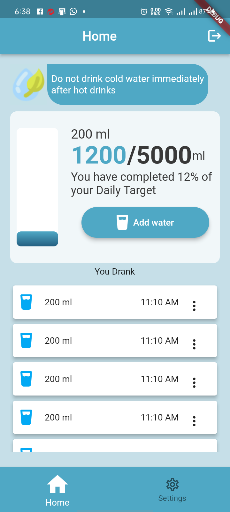
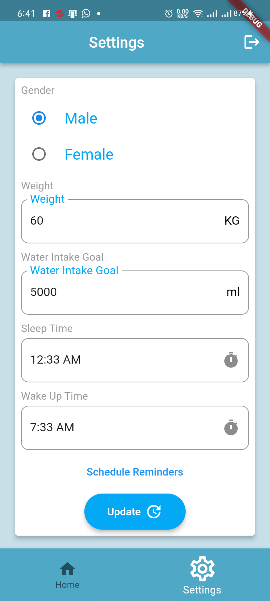
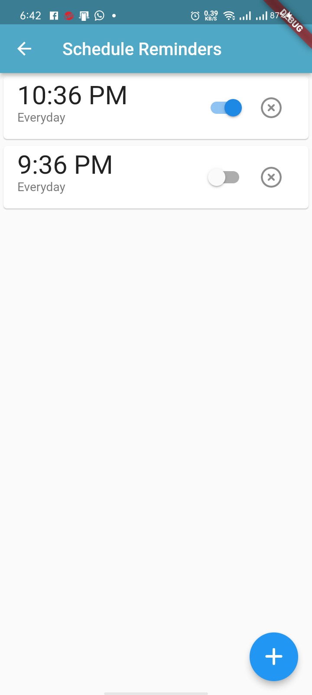

# water_reminder

A new Flutter project for maintaining your daily water intake.

## Purpose
This project is very helpful to make sure you are not dehydrating yourself. 

## Use Cases
This app helps user maintain his daily water intake and make sure that he drinks water according to his need and receive reminders as he have set reminders at his own convenience.

## Functionalities
This app have some major functionalities as give below
1. List of Water you drank accrding to time sorted.
2. A container showing how much water have drank.
3. A ratio telling you about your intake goal and how much have you drank.
4. A percentage telling how much percentage have you covered.
6. Update your details.
7. Splash Screen
8. Editing time of your water intake.
9. Reminder setter to remind you at your own convenient time.
10. Notifications according to your reminders.
11. User authentication.
12. On Boarding screen which will only appear once when you signup or if there is no data uploaded after signup.

## Here are some snaps which will explain a bit more easily

#### Home Screen
Home screen includes many components in it. First component is the a small message at the top of screen.

Second component is water card. This card includes a container which shows you your water intake amount.

Third is ratio of water intake. Shows how much have you drank out of your water intake which also have a percentage of how much have you drank.

Fourth is the add water button. This button adds a glass of water of 200 ml and show it in a list below.

Fifth is the last part which shows a list of water intake along with your times. This also have a popup menu button which onclick show you two tiles, one to delete and 
one to edit the time of current water intake glass's time.

#### Settings Screen
This screen also contains some components which are
1. You have an editor of your details that you inputed at on-Boarding screen.
2. Then you have a showReminder textButton which will take you to reminder_scheduler scree.
3. Update button update all the fields that are available

#### Reminder Screen
Reminder Screen show a list of reminders that user have saved according to his convenience.

There is a button to add reminders obviously available.

There is a switch to turn reminders on/off.

There is another button to delete reminders.

