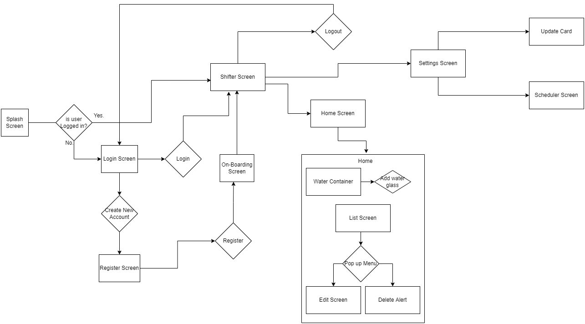

# Water Reminder
A new Flutter project. Which can help you to take care of your by reminding you to drink water and not let your skin dry and to keep record of your
daily water intake.

### User Flow Diagram

### Use Cases
In this app you can
1. add water glasses
2. delete water glasses
3. edit time of water glass
4. user will be able to input data on on-boarding screens
5. update this data that he entered using on-boarding screen
6. Generate Reminder for your self to drink water
7. delete reminders
8. view how much have you complete your daily water intake
9. view a container according to calculations of your daily water intake
10. Create account and authenticate

### Use Case and Description

1. #### Water Glasses
    Adding water glasses means keeping record of your daily water intake. You can add a glass of water when you drink one. This can be at anytime,anywhere.
You just need to tap on the button "Add Water" and your water glass will be added.
2. #### Delete Water Glass
   Deleting water glass means if we have added any glass of water mistakenly then we can delete it and keep our records clear and correct. There is an alert
after we click on delete button. That is because we may click the delete button mistakenly and we can correct our mistake.
3. #### Edit time
    This feature in our app located in home screen helps the user to change the time of glass of water that you drank. Because you may have added water glass
after some time of drinking water or something else.
4. #### On-Boarding Screen
   On-Boarding screen is a very helpful feature to in which we ask you some information on the basis of which we are going to display information to user.
5. #### Updating data after on-boarding screen
   This feature is used after user have stored information in on-boarding screen and he have entered some incorrect information or something in his info
have changed.
6. #### Reminder generation
    Reminder generations is the most important and very useful feature in this application. Which helps to remind you to drink water glass on your desired
time if you somehow forget.
7. #### Delete Reminders
   Delete reminders is a good feature if you want to correct your mistake instead of getting reminders unnecessarily.
8. #### Progress bar showing
    Showing a graph on your home screen is a very good feature telling you how much have you drank graphically instead of writing.
9. #### Intake goal completion percentage
    This feature is surely the same as showing a graph bar but not graphically. This shows you a percentage of how much have you completed.
10. #### Authentication
    Authentication plays a very important role in separating you from many others using same app. It also makes sure that no one is able to access your 
personal data

### Watch a video to understand flow of app.

